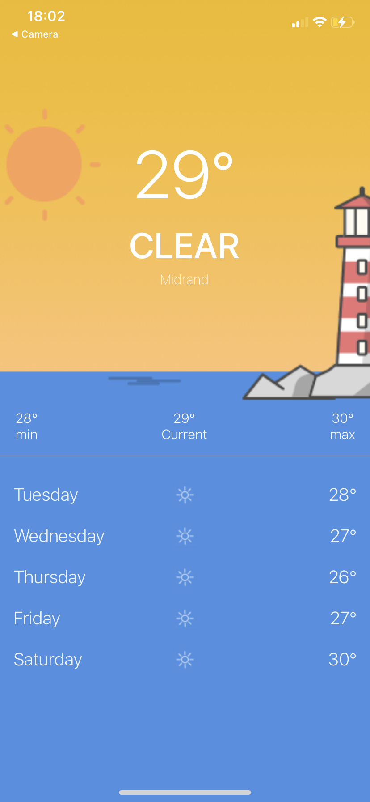

# Weather App ReadMe

### Conventions

- I used React Native, JavaScript and Expo.
- Variable and function names use camelCase.
- Component names are in PascalCase.

### Architecture

It follows a simple architecture with key components:

1. **HomeScreen**: The main component responsible for displaying weather information and forecasts. It handles data fetching, location access, and rendering the UI.

2. **Styles**: A separate module containing styling definitions for the components. It enhances code readability and maintainability.

3. **Assets**: Contains images and icons used in the application, organized based on weather conditions.

4. **AsyncStorage**: Used for storing weather data locally when there is no internet connection.

### General Considerations

- The API key is stored as an environment variable for security.
- It checks for internet connectivity using the NetInfo library and retrieves data from local storage when offline.
- Location permission is requested using the Expo Location library to get the user's coordinates for weather data retrieval.
- Weather conditions are categorized, and appropriate background images and icons are displayed based on the weather condition.
- Temperature units are displayed in Celsius (°C).
- The application handles errors and provides feedback to the user.

## Third-Party Dependencies

The Weather App relies on the following third-party libraries and dependencies:

1. **React**: The core library for building the user interface.
2. **React Native**: A framework for building native mobile apps using React.
3. **@react-native-community/netinfo**: Allows checking the device's internet connectivity status.
4. **@react-native-async-storage/async-storage**: Provides an asynchronous storage system for storing weather data locally.
5. **expo-location**: Enables access to device location information.
6. **OpenWeatherMap API**: Used for fetching weather data based on the user's location.

## How to Build the Project

To build and run the Weather App project, follow these steps:

1. Clone the project repository.
2. Install the project dependencies by running:
   ```
   npm install
   ```
   or
   ```
   yarn install
   ```
3. Use your API key on `REACT_WEATHER_KEY` in `.env.example` ad rename it to `.env`. The url for `REACT_BASE_URL` is already there.
4. Run the app on the device by executing:
   ```
   npm start
   ```
5. Follow the instructions in the terminal to open the app on your device or simulator.

## Additional Notes

- The application uses React hooks like `useState` and `useEffect` for state management and side effects.
- It includes error handling using `try...catch` blocks to log errors.
- The application includes a responsive design that adapts to different screen sizes.
- Forecast data is displayed for the next five days.
- Location access is requested explicitly to ensure proper functionality.
- Weather data is stored locally using AsyncStorage to improve user experience when offline.


